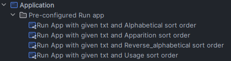
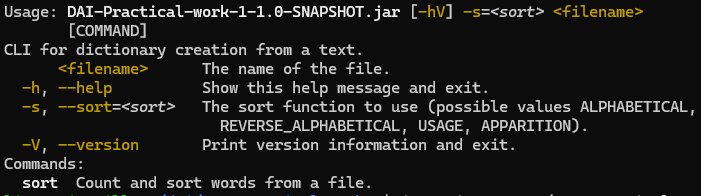
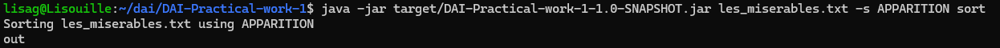
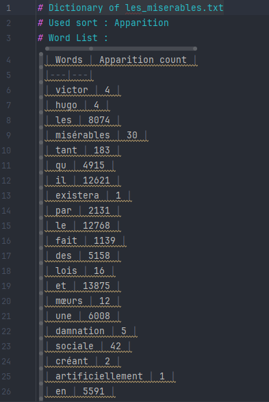
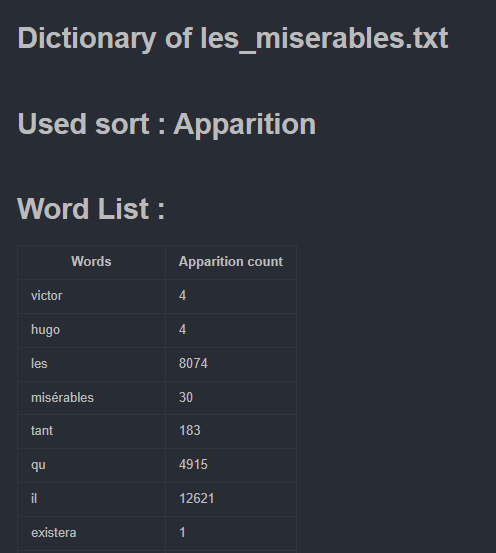

# Practical work 1

Lisa Gorgerat et Alex Berberat

## Table of content

- [Introduction](#introduction)
- [Application](#application)
    - [How to setup](#how-to-setup)
      - [Cloning our repository](#how-to-clone-our-repository)
      - [Build our application](#how-to-build-our-application)
    - [Demo](#demo)

## Introduction
In this practical work, we needed to create a CLI using picocli to process files in any way we wanted, as well as git and github to manage our code, maven to build our application and using java as programming language and to run our application.

We have chosen to write an application that take a text file containing a text in UTF8 format that print every word(only one time, if the word is there multiple times) and allow the user to sort this dictionary in alphabetical order, reverse alphabetical order, by order of apparition or by number of appearance.

We don't consider two words distinct if the only thing that change are the case of certain letters. Numbers aren't considered words, if they are in digit form. 

## Application
### How to setup
#### How to clone our repository
To set up our application, you first need to go to our repository on github: [Our repo](https://github.com/AlexB-HEIG/DAI-Practical-work-1).

Then you need to clone our repository:
1. Go to the folder where you want our repository to be.
2. Open a terminal there
3. use the command git clone with the ssh 
`git clone git@github.com:AlexB-HEIG/DAI-Practical-work-1.git`

#### How to build our application
To build our application, you need to use the following command on your terminal: 
`java -jar target/DAI-Practical-work-1-1.0-SNAPSHOT.jar <your file> <sort type> sort` 
ou 
`java -jar target/DAI-Practical-work-1-1.0-SNAPSHOT.jar <sort type> <your file> sort`

To build our application in your IDE, we have created build configurations with our text file and every type of sort: 
s

If you aren't sure, simply running `java -jar target/DAI-Practical-work-1-1.0-SNAPSHOT.jar` will make the following CLI appear: 

However, if you are a developer, and you have made some modifications, you need to repackage the application.
For that, we have made a maven configuration to package the application:  

### Demo
We have given a file (`les_miserables.txt`) on which you can test our application.

By running the desired command, in this case sorting by apparition of the words in the text, we get this: 

This generates a mardkdown file that can be found at the root of your folder.
By opening it in a coding program, you will have this output: 

If you open it in a space where you can visualize markdown, you will have this output: 

